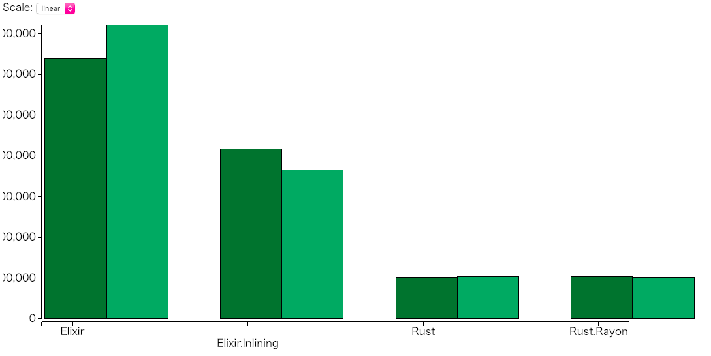

# LinearRegressorCli
$ git clone https://github.com/zeam-vm/linear_regressor_cli.git  
$ cd linear_regressor_cli  
$ git checkout -b rustlering origin/rustlering  
$ mix deps.get  
$ mix bench  

# Benchmark

```bash
$ mix bench
Compiling NIF crate :linear_regressor_nif (native/linear_regressor_nif)...
    Finished release [optimized] target(s) in 0.10s
Settings:
  duration:      1.0 s

## BostonModelBench
[03:07:09] 1/4: Elixir
[03:07:21] 2/4: Elixir.Inlining
[03:07:30] 3/4: Rust
[03:07:32] 4/4: Rust.Rayon

Finished in 25.42 seconds

## BostonModelBench
benchmark name   iterations   average time
Rust                      1   2026726.00 µs/op
Rust.Rayon                1   2052490.00 µs/op
Elixir.Inlining           1   8327351.00 µs/op
Elixir                    1   12775923.00 µs/op

```

